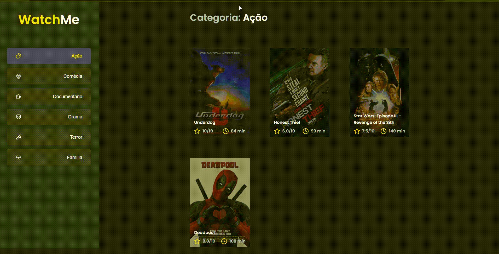

<h1> WatchMe </h1>

> Status: Developer ☝️

### Objetivo 
#### Segundo desafio do Ignite. Nesse desafio vamos um pouco mais longe no uso dos HOOKS, contendo [**useState**](https://pt-br.reactjs.org/docs/hooks-state.html) e [**useEffect**](https://pt-br.reactjs.org/docs/hooks-effect.html)   

 
  

### Sobre
<small> O WhatchMe, é um sistema para verificar filmes por meio dos generos. O usuário vai clicando nos tópicos e ao lado vai exibindo o filme contendo: duração,
 título, imagem e opção de favoritar

</small>

### Técnicas

- [x] Componentes
- [x] Hooks
- [X] Fake API com JSON Server

## Rodar o Projeto

#### `yarn server`
É necessário para iniciar o servidor da aplicação

#### `yarn dev`
Ao abrir o projeto dentro do seu editor de código

#### `yarn start`
Executa o aplicativo no modo de desenvolvimento. 
Abrir [http://localhost:3000](http://localhost:8080) para visualizar no navegador.

 
  <small> Josileudo Rodrigues - 2021</small>
</div
